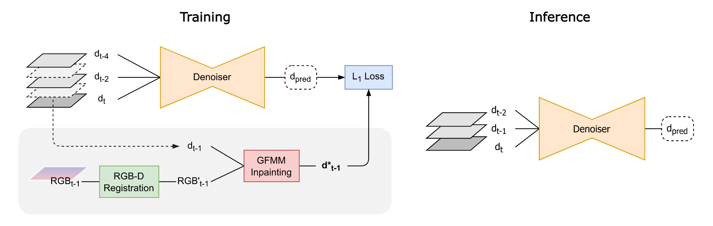

# SelfReDepth: A Self-Supervised Real-Time Depth Denoising and Restoration Approach for Consumer-Grade Sensors



SelfReDepth is a self-supervised deep learning approach to produce denoised and inpainted depth maps from RGB-D video sequences captured with depth sensors, such as the Kinect v2. The provided implementation exhibits real-time performance during inference if ran on sufficiently powerfull graphical hardware.

SelfReDepth was fine-tuned and tested particularly with Time-of-Flight depth sensing technology in mind, but it is fully prepared to denoise and restored depth maps captured with different sensing technologies (e.g. Structure Light). To operate SelfReDepth needs only to be provided with the raw depth + RGB frame sequences produced by a consumer-grade sensor, and ideally also the sensor's intrinsic and extrinsic parameters.


## Installation

<br>

**Warning:** Only native Windows is supported out-of-the-box for now. To add support for Unix or MacOS, [dynamic_linked_utils.py](./src/sred/utils/dynamic_linked_utils.py) and [fast_utils/](./src/sred/utils/fast_utils/) must be altered and compiled so that the shared library functions in your platform.

<br>

### **Install Package**
To install SelfReDepth you should start by cloning this repository:

    $ git clone https://github.com/alexduarte23/sred.git

And then, from the cloned directory, locally install the package:

    $ cd sred
    $ pip install -e .


### **Compile C++ Code (optional)**

Part of SelfReDepth is implemented in C++ and linked to python as a shared library.
A [pre-compiled](./src/sred/utils/fast_utils/pre-built/) instance of this library is already provided. If this doesn't work you must re-compiled it by:
1. Opening the provided Visual Studio 2019 solution [here](./src/sred/utils/fast_utils/).
2. Compiling the code in x64 architecture.
3. In [./src/sred/utils/fast_utils/shared/](./src/sred/utils/fast_utils/shared/), replace the provided dll file by the one you compiled. 

    - Alternatively, you can also re-direct the utils module to your dll file.
        ```python
        sred.utils.setDLL('your_dll_path.dll')
        ```


## GPU Support

SelfReDepth supports GPU accelerated computation through Tensorflow. To enable it you must have and NVIDIA graphics card and install the CUDA and cuDNN versions compatible with your installed tensorflow version.

More information on this can be found in the following links:
- [Tensorflow webpage on GPU support](https://www.tensorflow.org/install/pip#windows-native)
- [CUDA and cuDNN version compatibility](https://www.tensorflow.org/install/source#gpu)
- [Installation guide by NVIDIA](https://docs.nvidia.com/deeplearning/cudnn/install-guide/index.html#install-windows)

**Warning**: Tensorflow only provides GPU support for native Windows up to version 2.10. As such, during installation SelfReDepth limits the Tensorflow installation to said version.


## How To Use

In [example](./examples/train_and_test.ipynb) you can find a working example written as a jupyter notebook.

To run the example you need to install jupyter and gdown:
    
    $ pip install jupyter
    $ pip install gdown

More succinctly, to **prepape the model** with your data you should:
1. Import SelfReDepth
    
    ```python
    import sred
    ```
2. Generate targets for the model (saved to disk)
    
    ```python
    target_gen = sred.data.TargetGenerator(target_gen_params)
    target_gen.generate(d_dirs, rgb_dirs, target_dirs, exist_ok=True)
    ```

3. Build the training datasets
    
    ```python
    train_ds, val_ds, test_ds = sred.data.build_all_datasets(
        d_dirs,
        target_dirs,
        batch_size = 4,
        val_split = 0.1,
        test_split = 0.04
    )
    ```

4. Define and train the model
    
    ```python
    model = sred.SReDModel(frame_shape=(424,512,1), input_frames=3, residual=-1)
    model.default_compile()
    model.summary()
    res = model.default_fit(
        train_ds,
        epochs = 100,
        steps_per_epoch = 200,
        validation_data = val_ds,
        output_dir = output_dir
    )
    ```

You can then **use the train model** to denoise and inpaint depth maps:

```python
model.predict(test_ds)
```
OR

```python
model.predict(image) # ndarray of shape (1,H,W,C)
```

## Extra

SelfReDepth also comes with additional image handling and dataset generation functions that might be useful during development.

As well as 3 GUI [tools](./src/sred/tools/), of which the following two are particularly relevant:
- **depth_viewer**: helps visualizing depth videos.
- **registration_tuner**: helps determining and fine-tuning the sensor instinsic and extrinsic paraemters used for target generation section of SelfReDepth.

Which can be accessed by importing:

```python
import sred.tools
```